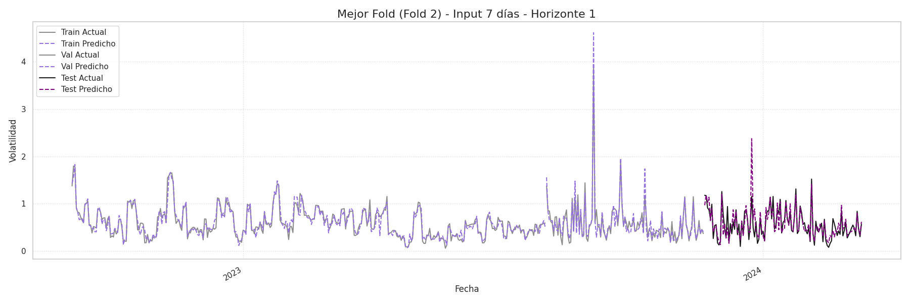

# 📈 Predicción de Volatilidad de Bitcoin con MLP y MLOps


Un proyecto de **Deep Learning** para predecir la volatilidad del precio diario de Bitcoin (BTC) usando un modelo **MLP multi-salida**, implementado dentro de un pipeline completo de **MLOps**: desde la exploración de datos hasta el despliegue de una API.

---

##  Acerca del Proyecto

El mercado de Bitcoin se caracteriza por una **volatilidad excepcionalmente alta**. Este proyecto aborda el desafío de predecir dicha volatilidad, un componente clave para la gestión de riesgo, el trading algorítmico y las estrategias de cobertura en mercados de criptomonedas.

A diferencia de la predicción directa del precio, el **forecasting de volatilidad** es más robusto y fundamental dentro del análisis cuantitativo moderno.

Este repositorio implementa un pipeline completo para:

1.  **Analizar** el comportamiento del precio de cierre diario de BTC.
2.  **Calcular** la volatilidad histórica (rolling std de retornos logarítmicos).
3.  **Entrenar** un modelo `MLPRegressor` multi-salida para predecir 7 horizontes de volatilidad.
4.  **Validar** el modelo con `timeseries-cv` evitando *data leakage*.
5.  **Diagnosticar** residuos con pruebas estadísticas (BDS test).
6.  **Empaquetar** el mejor modelo en una API con FastAPI.
7.  **Contenerizar** la aplicación con Docker.
8.  **Automatizar** pruebas con CI/CD (GitHub Actions).

**Dataset:** Histórico de precios diarios BTC/USD (2018–2025) desde Binance.
Archivo: [`data/btc_1d_data_2018_to_2025.csv`](data/btc_1d_data_2018_to_2025.csv)

---

##  Resultados

Tras entrenar y evaluar los modelos con ventanas de 7, 14, 21 y 28 días, el **modelo con un lag de 7 días** obtuvo el mejor rendimiento general en el conjunto de test, con un **RMSE promedio de 0.2978**.

A continuación se muestra una visualización de las predicciones del mejor modelo frente a los valores reales para uno de los folds de validación:



---

##  Tecnologías Utilizadas

- **Análisis y Modelado:** Python, Pandas, NumPy, Scikit-learn
- **API:** FastAPI, Uvicorn
- **Contenerización:** Docker
- **CI/CD:** GitHub Actions
- **Testing:** Pytest
- **Visualización:** Matplotlib, Jupyter Notebook

---

##  Instalación

### Requisitos Previos
- Python 3.10+
- pip & venv
- Docker

### Pasos

```bash
# Clonar repositorio
git clone [https://github.com/hydemon8/btc-volatility-mlops.git](https://github.com/hydemon8/btc-volatility-mlops.git)
cd btc-volatility-mlops

# Crear entorno virtual
python -m venv venv
source venv/bin/activate   # Linux/Mac
venv\Scripts\activate      # Windows

# Instalar dependencias
pip install -r requirements.txt

``` 

##  Uso

### 1. Experimentación en Notebooks
Ejecutar en orden:

1. [`notebooks/1_eda_volatility.ipynb`](notebooks/1_eda_volatility.ipynb) → EDA y cálculo de volatilidad.  
2. [`notebooks/2_model_training.ipynb`](notebooks/2_model_training.ipynb) → Entrenamiento y validación con diferentes lags (7, 14, 21, 28).  
3. [`notebooks/3_residual_analysis.ipynb`](notebooks/3_residual_analysis.ipynb) → Análisis de residuos y BDS test.  

### 2. Ejecutar con Docker

```bash
# 1. Construir la imagen de Docker
docker build -t btc-volatility-api .

# 2. Ejecutar el contenedor
docker run -p 8000:8000 btc-volatility-api

```

La API estará en: http://127.0.0.1:8000 

Documentación interactiva (Swagger UI): http://127.0.0.1:8000/docs

- *Ejecutar la API localmente (Alternativa)*

```bash

uvicorn app.api:app --reload

```


### 3. Endpoints de la API

La API expone **dos endpoints principales** para predecir la volatilidad:

| Endpoint               | Descripción                                                                 | Input principal      | Output |
|-------------------------|-----------------------------------------------------------------------------|----------------------|--------|
| **`/predict`**          | Predice la volatilidad usando como entrada valores de volatilidad ya calculados (features). | `features` (array de floats) | Predicciones de volatilidad (array de floats) |
| **`/predict-from-prices`** | Predice la volatilidad a partir de precios de cierre; la API calcula internamente la volatilidad usando un método estadístico (ej. rolling). | `prices` (array de floats) + `method` | Predicciones de volatilidad (array de floats) |

A continuación, se muestran ejemplos de uso con `curl`. 

Opción 1: Volatilidad ya calculada 

```bash
curl -X 'POST' \
  'http://127.0.0.1:8000/predict' \
  -H 'accept: application/json' \
  -H 'Content-Type: application/json' \
  -d '{
  "lag": 14,
  "features": [
    0.01,
    0.012,
    0.013,
    0.014,
    0.015,
    0.016,
    0.017,
    0.018,
    0.019,
    0.02,
    0.021,
    0.022,
    0.023,
    0.024
  ]
}'

```

Opción 2: Predecir a partir de precios

```bash
curl -X 'POST' \
  'http://127.0.0.1:8000/predict-from-prices' \
  -H 'accept: application/json' \
  -H 'Content-Type: application/json' \
  -d '{
  "lag": 14,
  "prices": [
    30000,
    30200,
    30100,
    30500,
    30750,
    30800,
    31000,
    31200,
    31150,
    31300,
    31550,
    31400,
    31600,
    31800,
    31750,
    32000,
    31900,
    32100,
    32350,
    32200,
    31250
  ],
  "method": "rolling"
}'

```
## Estructura del proyecto

btc-volatility-mlops/
├── app/               # Lógica de la API (FastAPI) y modelo serializado
├── data/              # Dataset original
├── notebooks/         # Proceso de análisis y modelado
├── results/           # Tablas de métricas generadas
├── tests/             # Pruebas unitarias (pytest)
├── .github/workflows/ # Pipeline de CI/CD con GitHub Actions
├── Dockerfile         # Receta para construir la imagen de la API
├── requirements.txt   # Dependencias del proyecto
└── README.md          # Documentación

## Contacto 

**Sara Guerra** - [LinkedIn](https://www.linkedin.com/in/saramguerrar) - guerrams@uninorte.edu.co